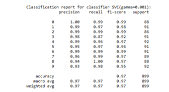
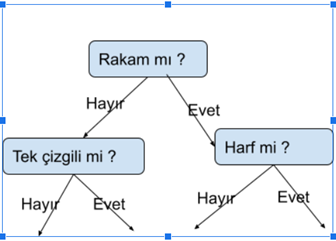
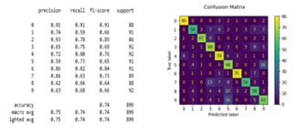

Hello Guys :) ✋ :raised_hand:	

Artificial neural networks from the fascinating world of science

# Table of Contents
- [Table of Contents](#table-of-contents)
  - [Problems](#problems)
  - [Solitions Road](#solitions-road)
  - [MlNet](#mlnet)
  - [Back Pro Algorihm](#back-pro-algorihm)
  - [Train](#train)
  - [Traing Data](#traing-data)

## Problems
Although there are many alternative means of communication today, handwriting has continued and will continue to exist as a means of communication and information recording between people. Considering the prevalence of human processes, machine recognition of handwriting is of great importance. Our names and surnames that we write in handwriting, the information on envelopes in letter submissions, amounts in banks or checks, handwriting fields in forms, this and many other examples like this are great practice for reading because the computer is better able to act in reading some handwritings. Apart from these, it is necessary in optimized systems. For example, the form we fill out when we go to a cargo company is processed by the employee there, and we can have machines do such operations.

[Tr]
 El yazısı, günümüzde pek çok alternatif iletişim araçları olsada, insanlar arası iletişim ve bilgi kaydetme aracı olarak varlığını sürdürmeye devam etmiştir ve edecektir.İnsan işlemlerinin yaygınlığı göz önünde bulundurulduğunda, el yazılarının makine tarafından tanınması büyük bir öneme sahiptir.Örneğin hat çıkarmak için atılan imza ve el yazısı şeklinde yazdığımız isim ve soy isimlerimiz,mektup gönderimlerindeki zarfların üzerindeki bilgiler,banka veya çeklerdeki tutarlar,formlardaki el yazısı alanlarında bu ve bunun gibi bir çok örnekte harfleri ve sayıları bilgisayara tanıtmamız okuma için büyük bir pratiktir çünkü bazı el yazılarının okunmasında bilgisayar daha iyi hareket edebilir bunlar haricinde optimize sistemler içinde gereklidir.Örneğin bir kargo şirketine gittiğimizde doldurduğumuz form oradaki çalışan tarafından bilgisayara işlenmektedir bunun gibi işlemleri makinelere yaptırabilriz.

## Solitions Road

<h3><b>A. Support Vector Machine</b></h3>

[En] 
Support vector machines, first of all, the data set in this and other solution techniques algorithms is the digits data set in the sklearn library. (See[1]) This data set consists of 1797 binary numbers and has 9 classes and 8x8 64 features. It adopts the supervised learning model. , is an accurate and powerful classifier for our problem, it gives good results even though it works slowly. As a result of our experiment, the success rate has an "Accuarcy" value of 0.9597. The values obtained as a result of the study are given below.

[Tr] 
Destek vektör makineleri, öncelikle bu ve diğer çözüm teknikleri algoritmalarındaki veri seti sklearn kütüphanesinde bulunan digits veri setidir.(Bkz[1]) Bu veri seti 1797 adet binary sayılarıdan oluşan 9 sınıflı ve 8x8 64 adet özelliğe sahiptir.Denetimli öğrenme modelini benimser, bizim problemimiz için doğru ve güçlü bir sınıflandırıcıdır, yavaş çalışmasına rağmen güzel sonuçlar verir.Deneyimiz sonucunda başarı or ani 0.9597 “Accuarcy(Başarı)” değerine sahiptir.Çalışma sonucunda oluşan değerler aşağıda yer almaktadır.

<h3><b>B. Karar Ağacı Yöntemi(Desicion Tree)</b></h3>

[En]
This method is one of the topics of machine learning. It is a classification algorithm. (See[2])
This technique classifies the given training set and when a different example is given to the algorithm, it draws a conclusion for these training sets. For example, let's give the algorithm from handwritten examples of 50 “A”,”B”,”1” symbols. Let's read it as a bytes and make a classifier over bytes.

[Tr]
Bu yöntem makine öğrenmesi konularında birisidir.Bir sınıflandırma algoritmasıdır.(Bkz[2])
Bu teknik verilen eğitim kümesini sınıflandırır ve algoritmaya farklı bir örnek verildiğinde bu eğitim kümelerine yönelik bir sonuç çıkarır örnek verecek olursak algoritmaya 50 adet “A”,”B”,”1” sembollerinin el yazısı örneklerinden verelim.Bu algoritmada veriler resim olacakları için resimleri byte olarak okutalım ve bytler üzerinden bir sınıflandırıcı yapabiliriz.Örneğin aşağıdaki grafı inceleyebiliriz.

We can reproduce this graph and as a result classify the incoming data by placing numbers and letters on the outputs of the graph.

[Tr]
Bu grafı çoğaltabiliriz ve sonuç olarak rakam ve harfleri grafın çıktılarına yerleştirerek gelen verileri sınıflandırabiliriz

[Tr]
Karar ağacı kullanılan örneklerdeki f1 score’lara göre en düşük değere sahiptir .Algoritmanın raporu ve kıarmaşıklık matrisi yukarıdaki görseldeki gibidir.

<h3><b>C.	Knn Algoritması</h3></b>

The nearest neighbor finding algorithm is a popular classification algorithm. It is generally used in structures that we do not want to establish a model. All the examples in the training data set are used as models, then all kinds of operations are waited until the new incoming individual classification is completed, so it is very cumbersome in terms of performance.
The new incoming letter is added to the data class.
K neighbor is checked (It is important to determine the K value.)
Distances are calculated with the distance function (the most common use is Euclidean)
The individual is assigned to the closest point.

En yakın komşuluk bulma algoritması, popüler bir sınıflandırma algoritmasıdır.Genellikle model kurmak istemediğimiz yapılarda kullanılır.Eğitim veri setindeki bütün örnekler model olarak kullanılır daha sonra yeni gelen birey sınıflandırma işlemleri tamamlanıncaya kadar her türlü işlem bekletilir bu sebeple performans bakımından çok hantaldır.
Yeni gelen harf veri sınıfa eklenir.
K komşusuna bakılır(K değerini belirlemek önemlidir.)
Uzaklık fonksiyonu ile uzaklıklar hesaplanır(En yaygın kullanımı öklid )
En yakın noktaya birey atanır.

## MlNet
Ml.Net is a windows-based machile learning algorithm. You can access the Ml.Net page from the menu on the top left. Here, the number you wrote thanks to html canva is estimated over the data set pre-trained by the ml.net LightGBM algorithm, and the class with the highest success value is in bold. presented to the user as

[Tr]
Ml.Net windows tabanlı bir machile learning algoritmasıdır.Sol üstteki menüden  Ml.Net sayfasına ulaşabilirsiniz.Burada html canva sayesinde yazdığınız rakam ml.net LightGBM  algoritması tarafından önceden train edilmiş veri seti üzerinden yazdığınız rakam tahmin edilir ve en yüksek başarı değerine sahip sınıf koyu renkli olarak kullanıcıya sunulur

## Back Pro Algorihm

In the back propagation algorithm, you can enter the letter or number that needs to be guessed from the menu on the left and choose the train model and then guess. The related image shows that an input with 50 percent A picture and 50 percent F picture is entered.

[Tr]
Geri yayılım algoritmasında sol taraftaki menüden tahmin edilmesi gereken harf yada sayıyı girip train model sectikten sonra tahmin et diyebilirsiniz.İlgili görselde yüzde 50 oranında A resmine yüzde 50 oranındada F resmine sahip bir input girildiği gösteriliyor.

## Train
If you want to train a model, first name it and then the number of layers.
You can train the data according to the scenarios. The learningRate in the table is set to 0.2, and the calculation of other layers is explained in detail in the report.

[Tr]Eğer bir model eğitmek isterseniz öncelikle ismini daha sonra katman sayısı 1(Sadece Öngirdi ve Çıkış)-2(Öngirdi-girdi-çıkış)-3(Öngirdi-girdi-gizli-çıkış)
senaryolarına göre verileri eğitebilirsiniz.Tabloda yer alan learningRate 0.2 olarak sabit bırakılmıştır diğer katmanların hesaplanması raporda detaylı şekilde anlatılmaktadır.

## Traing Data

If you want to add a picture to the training dataset. You can manage your data from this page. These data are used while training. You can also add a picture as a table from this page. If you add a group, the name column is considered as the group name.

[Tr]Eğer eğitim veri kümesine bir resim eklemek isterseniz.Bu sayfadan verilerinizi yönetebilirsiniz bu veriler train edilirken kullanılmaktadır.Bu sayfadan ayrıca tablo olarakta resim ekleme yapabilirsiniz toplu olarak eklendiğiniz takdirde adı sütünü grup adı olarak nitelendirilmektedir.

