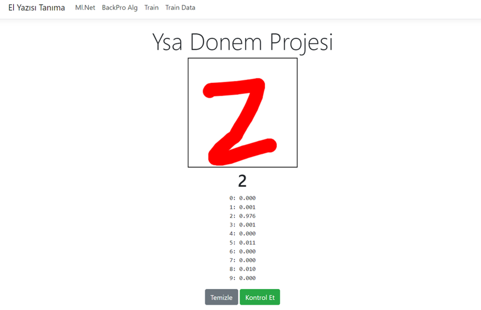
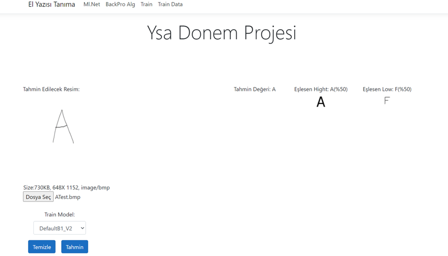
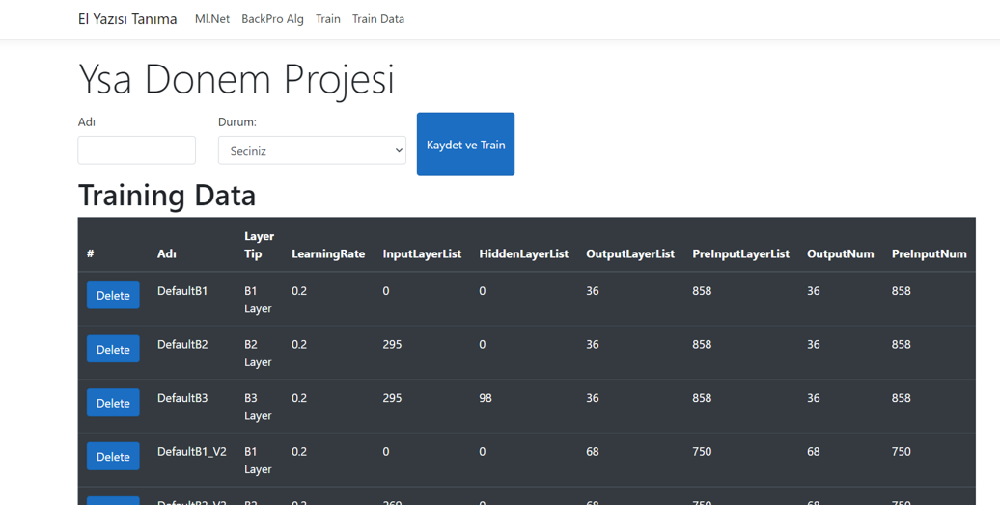
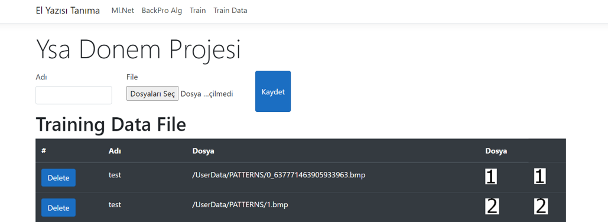

Hello Guys :) ✋ :raised_hand:	

Artificial neural networks from the fascinating world of science

# Table of Contents
- [Table of Contents](#table-of-contents)
  - [Problems](#problems)
  - [MlNet](#mlnet)
  - [Back Pro Algorihm](#back-pro-algorihm)
  - [Train](#train)
  - [Traing Data](#traing-data)

## Problems
Although there are many alternative means of communication today, handwriting has continued and will continue to exist as a means of communication and information recording between people. Considering the prevalence of human processes, machine recognition of handwriting is of great importance. Our names and surnames that we write in handwriting, the information on envelopes in letter submissions, amounts in banks or checks, handwriting fields in forms, this and many other examples like this are great practice for reading because the computer is better able to act in reading some handwritings. Apart from these, it is necessary in optimized systems. For example, the form we fill out when we go to a cargo company is processed by the employee there, and we can have machines do such operations.

[Tr]
 El yazısı, günümüzde pek çok alternatif iletişim araçları olsada, insanlar arası iletişim ve bilgi kaydetme aracı olarak varlığını sürdürmeye devam etmiştir ve edecektir.İnsan işlemlerinin yaygınlığı göz önünde bulundurulduğunda, el yazılarının makine tarafından tanınması büyük bir öneme sahiptir.Örneğin hat çıkarmak için atılan imza ve el yazısı şeklinde yazdığımız isim ve soy isimlerimiz,mektup gönderimlerindeki zarfların üzerindeki bilgiler,banka veya çeklerdeki tutarlar,formlardaki el yazısı alanlarında bu ve bunun gibi bir çok örnekte harfleri ve sayıları bilgisayara tanıtmamız okuma için büyük bir pratiktir çünkü bazı el yazılarının okunmasında bilgisayar daha iyi hareket edebilir bunlar haricinde optimize sistemler içinde gereklidir.Örneğin bir kargo şirketine gittiğimizde doldurduğumuz form oradaki çalışan tarafından bilgisayara işlenmektedir bunun gibi işlemleri makinelere yaptırabilriz.

## MlNet
Ml.Net is a windows-based machile learning algorithm. You can access the Ml.Net page from the menu on the top left. Here, the number you wrote thanks to html canva is estimated over the data set pre-trained by the ml.net LightGBM algorithm, and the class with the highest success value is in bold. presented to the user as

[Tr]
Ml.Net windows tabanlı bir machile learning algoritmasıdır.Sol üstteki menüden  Ml.Net sayfasına ulaşabilirsiniz.Burada html canva sayesinde yazdığınız rakam ml.net LightGBM  algoritması tarafından önceden train edilmiş veri seti üzerinden yazdığınız rakam tahmin edilir ve en yüksek başarı değerine sahip sınıf koyu renkli olarak kullanıcıya sunulur

## Back Pro Algorihm

In the back propagation algorithm, you can enter the letter or number that needs to be guessed from the menu on the left and choose the train model and then guess. The related image shows that an input with 50 percent A picture and 50 percent F picture is entered.

[Tr]
Geri yayılım algoritmasında sol taraftaki menüden tahmin edilmesi gereken harf yada sayıyı girip train model sectikten sonra tahmin et diyebilirsiniz.İlgili görselde yüzde 50 oranında A resmine yüzde 50 oranındada F resmine sahip bir input girildiği gösteriliyor.

## Train
If you want to train a model, first name it and then the number of layers.
You can train the data according to the scenarios. The learningRate in the table is set to 0.2, and the calculation of other layers is explained in detail in the report.

[Tr]Eğer bir model eğitmek isterseniz öncelikle ismini daha sonra katman sayısı 1(Sadece Öngirdi ve Çıkış)-2(Öngirdi-girdi-çıkış)-3(Öngirdi-girdi-gizli-çıkış)
senaryolarına göre verileri eğitebilirsiniz.Tabloda yer alan learningRate 0.2 olarak sabit bırakılmıştır diğer katmanların hesaplanması raporda detaylı şekilde anlatılmaktadır.

## Traing Data

If you want to add a picture to the training dataset. You can manage your data from this page. These data are used while training. You can also add a picture as a table from this page. If you add a group, the name column is considered as the group name.

[Tr]Eğer eğitim veri kümesine bir resim eklemek isterseniz.Bu sayfadan verilerinizi yönetebilirsiniz bu veriler train edilirken kullanılmaktadır.Bu sayfadan ayrıca tablo olarakta resim ekleme yapabilirsiniz toplu olarak eklendiğiniz takdirde adı sütünü grup adı olarak nitelendirilmektedir.

